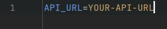

# README - Open-Meteo Vejrdata Konsolprogram

## Table of Content

1. [Beskrivelse](#beskrivelse)
2. [Dokumentation](#dokumentation)
3. [Installation og Konfiguration](#installation-og-konfiguration)
4. [Funktioner](#funktioner)  
   4.1 [Minimumskrav](#minimumskrav)  
   4.2 [Ekstra funktioner](#ekstra-funktioner)
5. [TO:DO](#todo)
6. [Kontakt](#kontakt)

## Beskrivelse

Dette er et konsolprogram, der henter og viser vejrdata fra Open-Meteo API'et. Programmet giver brugeren mulighed for at se aktuel vejrstatus, højeste og laveste temperaturer inden for de næste 24 timer, gennemsnitlig vindhastighed samt en time-for-time oversigt over vejret de næste 24 timer.

## Dokumentation

Officiel API-dokumentation: [Open-Meteo.com](https://open-meteo.com/en/docs)

## Installation og Konfiguration

1. Sørg for at have .NET installeret.

2. Clone eller download dette repository.

3. Installer nødvendige NuGet-pakker:
    - Newtonsoft.Json
    - System.Net.Http
    - Spectre.Console
      
4. Du skal bruge en API URL for dette program, du kan hente en API URL fra [Open-Meteo.com](https://open-meteo.com/en/docs)

For at få den API URL, der passer til dette program, følg disse trin på Open-Meteo:
- **Location and Time**:
    - **Latitude**: 55,6759
    - **Longitude**: 12,5655
    - **Timezone**: Europe/Berlin
    - **Latitude**: 51,5085
    - **Longitude**: -0,1257
    - **Timezone**: Europe/Berlin
        - **Time Forecast Length**:
            - **Forecast Days**: 7
            - **Past Days**: 1 week

- Åben **Additional Variables and Options** og vælg **24 timer** under **Past Hours**.
    - **Marker følgende**:
        - **Daily Weather Variables**:
            - Rain Sum
            - Maximum Temperature (2 m)
            - Minimum Temperature (2 m)
            - Maximum Wind Speed (10 m)
        - **Current Weather**:
            - Temperature (2 m)
            - Wind Speed (10 m)
            - Is Day or Night
            - Rain
        - **Hourly Weather Variables**:
            - Temperature (2 m)
            - Wind Speed (10 m)
        - **Settings**:
            - Temperature Unit: Celsius °C
            - Wind Speed Unit: Km/h
            - Precipitation Unit: Millimeter
            - Time Format: ISO 8601 (e.g., 2025-03-20)

5. Omdøb `config-example.env` til `config.env`.
6. Åbn `config.env` og indsæt den API-URL du lige har lavet fra Open-Meteo.com.
   

8. Kør programmet:
    - Følg menuen for at navigere og se vejrdata.

## Funktioner

### Minimumskrav:
- Hent og vis:
    - Vejrudsigten lige nu (mindst to datasæt).
    - Højeste temperatur de næste 24 timer.
    - Laveste temperatur de næste 24 timer.
    - Gennemsnitlig vindhastighed de næste 24 timer.
    - Liste over vejret time-for-time de næste 24 timer (sorteret faldende).

### Ekstra funktioner:
- Menu-navigation for at skifte mellem visninger, såsom:
    - Vejret lige nu.
    - Tidspunktet med størst sandsynlighed for regn.
    - Vejret de seneste 24 timer.
    - Vejret den seneste uge som et dagsskema i konsollen.
- Mulighed for at vælge og gemme en by, så programmet husker den ved næste opstart.

## TO:DO
- [ ] Saveable location
- [ ] More generic (Så det virker med forskellige api URLs)

## Kontakt
- Discord: synx_eu
- Ikke muligt at kontakte mig på email lige nu